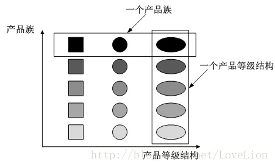

[TOC]

# 工厂方法模式个人总结

## 简单工厂模式

​	工厂方法就是这个模式的核心,它包含必要的判断逻辑,可以根据工厂类直接创造自己的实力,简单工厂模式是工厂方法模式的特殊情况,但是不符合**OCP(开闭原则)**

## 工厂方法模式

​	工厂方法模式在工厂和产品之间增加接口,让子类决定实例化某一类,它针对的是某一类产品,也就是说**一个产品等级结构一个工厂**, 工厂方法中有一个抽象工厂,多个具体工厂,每个具体工厂对应一种产品

##抽象工厂方法

​	抽象方法是工厂方法中最具抽象的一种,它主要针对的是一系列的产品呢,也就是**产品族**.**它有多个抽象产品类,每个抽象产** **品类派生出多个具体产品类,一个抽象工厂类派生出多个具体工厂类,每个具体工厂类创建多个具体产品类**.工厂方法模式和抽象工厂方法模式的最主要的区别就是,**工厂方法模式针对的是一个产品等级结构,而抽象工厂方法针对的是多个产品等级结构也就是产品族** 

## 产品族和产品等级结构

​	**工厂方法模式中**,一个抽象工厂创建一个产品等级结构的产品<br>	**抽象工厂方法中**,一个抽象工厂创建一个产品族的产品 

​	**产品等级结构**可以理解为同一种东西的不同的系列,比如电视机有海尔电视机,惠普电视机, 门有铁门,木门,都是同一种产品,但是他们的厂家或者制造方式不同<br>**产品族**可以理解为同一个地方生产的不同种类的产品,比如海尔厂家生产海尔电视机,电冰箱,洗衣机,木头厂制造木门,木桌子木椅子 ,它们都是同一个厂家制造的,不同种类的产品

右侧为产品等级结构和产品族的示意图 

  ## 一个车的例子

### 简单工厂方法模式

一个工厂要生产所有种类的车

#### 产品

```java
package com.fei.main.part3.section13;

/**
 * 大客车(抽象产品)
 * @author xurunfei
 * @date 2017/12/1.
 */
public interface Car {
    /**
     * 生产
     * @author: xurunfei
     * @date: 2017/12/1 15:59
     */
    void getRook();
}
```

```java
package com.fei.main.part3.section13;

/**
 * 大客车(具体产品)
 * @author xurunfei
 * @date 2017/12/1.
 */
public class BigCar implements Car{
    @Override
    public void getRook() {
        System.out.println("大客车开始生产.......");
    }
}
```

```java
package com.fei.main.part3.section13;

/**
 * 小客车(具体产品)
 * @author xurunfei
 * @date 2017/12/1.
 */
public class SmallCar implements Car {
    @Override
    public void getRook() {
        System.out.println("小客车开始生产.....");
    }
}
```

#### 工厂

```java
package com.fei.main.part3.section12;

/**
 * 汽车工厂(简单工厂)
 * @author xurunfei
 * @date 2017/12/5.
 */
public class RookFactory {
    public Car createRook(String type){
        Car car = null;
        switch (type){
            case "bigCar":
                car = new BigCar();
                break;
            case "smallCar":
                car = new SmallCar();
                break;
        }
        return car;
    }
}

```

#### 客户端

```java
package com.fei.main.part3.section12;

/**
 * 调用
 * @author xurunfei
 * @date 2017/12/1.
 */
public class Client {
    public static void main(String[] args) {
        Car freightCar = RookFactory.createRook("bigCar");
        freightCar.getRook();//生产车
    }
}
```

#### 小结

​	由上面可以看出,通过简单工厂方法```RookFactory```的```createRook```方法直接生产车

 	优点:工厂方法包含判断逻辑,客户端直接实例化类,去除产品依赖

​	缺点:如果要添加新的产品需要修改工厂方法类,违背了开闭原则

### 工厂方法模式

#### 产品

```java
package com.fei.main.part3.section13;

/**
 * 大客车(抽象产品)
 * @author xurunfei
 * @date 2017/12/1.
 */
public interface Car {
    /**
     * 生产
     * @author: xurunfei
     * @date: 2017/12/1 15:59
     */
    void getRook();
}
```

```java
package com.fei.main.part3.section13;

/**
 * 大客车(具体产品)
 * @author xurunfei
 * @date 2017/12/1.
 */
public class BigCar implements Car{
    @Override
    public void getRook() {
        System.out.println("大客车开始生产.......");
    }
}
```

```java
package com.fei.main.part3.section13;

/**
 * 小客车(具体产品)
 * @author xurunfei
 * @date 2017/12/1.
 */
public class SmallCar implements Car {
    @Override
    public void getRook() {
        System.out.println("小客车开始生产.....");
    }
}
```

#### 工厂

```java
package com.fei.main.part3.section13.factory;

import com.fei.main.part3.section13.Car;

/**
 * 客车工厂(抽象工厂)
 * @author xurunfei
 * @date 2017/12/1.
 */
public interface CarFactory {
    Car createCar();
}

```

```java
package com.fei.main.part3.section13.factory;

import com.fei.main.part3.section13.Car;
import com.fei.main.part3.section13.BigCar;

/**
 * 大客车工厂(具体工厂)
 * @author xurunfei
 * @date 2017/12/1.
 */
public class BigCarFactory implements CarFactory{
    @Override
    public Car createCar() {
        return new BigCar();
    }
}
```

```java
package com.fei.main.part3.section13.factory;

import com.fei.main.part3.section13.Car;
import com.fei.main.part3.section13.SmallCar;

/**
 * 小客车工厂(具体工厂)
 * @author xurunfei
 * @date 2017/12/1.
 */
public class SmallCarFactory implements CarFactory {
    @Override
    public Car createCar() {
        return new SmallCar();
    }
}

```

####客户端

```java
package com.fei.main.part3.section13;

import com.fei.main.part3.section13.factory.CarFactory;
import com.fei.main.part3.section13.factory.BigCarFactory;

/**
 * 调用
 * 	当一个类不知道它所必须创建对象的类或一个类希望由子类来指定它所创 建的对象时，
 *  当类将创建对象的职责委托给多个帮助子类中的某一个，并且你希望将哪一个帮助子类是代理者这一信息局部化的时候，
 *  可以使用工厂方法。
 * @author xurunfei
 * @date 2017/12/1.
 */
public class Client {
    public static void main(String[] args) {
        CarFactory freightCarFactory = new BigCarFactory();

        Car freightCar = freightCarFactory.createCar();
        freightCar.getRook();
    }
}

```

#### 小结

​	由上面看出,工厂方法和简单工厂的区别就是,简单工厂实例化通过一个工厂完成,而工厂方法,每一个具体产品就要一个具体工厂来实例化,并且工厂方法是符合```ocp``` (开闭)原则的

​	优点:添加产品不需要修改工厂方法,符合```ocp``` 原则

​	缺点:<br>		1. 增加一个产品就要增加一个工厂<br>		2. 只能处理单一等级结构的产品

### 抽象工厂方法模式

#### 产品1

```java
package com.fei.main.part3.section14.AutoMobile;

/**
 * 汽车(抽象产品)
 * @author xurunfei
 * @date 2017/12/1.
 */
public interface AutoMobile {
    void getRook();
}

```

```java
package com.fei.main.part3.section14.AutoMobile;

/**
 * 大型汽车(具体产品)
 * @author xurunfei
 * @date 2017/12/1.
 */
public class BigAutoMobile implements AutoMobile {
    @Override
    public void getRook() {
        System.out.println("汽车开始生产......");
    }
}

```

```java
package com.fei.main.part3.section14.AutoMobile;

/**
 * 小型汽车(具体产品)
 * @author xurunfei
 * @date 2017/12/1.
 */
public class SmallAutoMobile implements AutoMobile {
    @Override
    public void getRook() {
        System.out.println("小汽车开始生产......");
    }
}

```

#### 产品2

```java
package com.fei.main.part3.section14.Car;

/**
 * 大巴
 * @author xurunfei
 * @date 2017/12/1.
 */
public interface Car {
    /**
     * 生产
     * @author: xurunfei
     * @date: 2017/12/1 15:59
     */
    void getRook();
}

```

```java
package com.fei.main.part3.section14.Car;

/**
 * 大客车
 * @author xurunfei
 * @date 2017/12/1.
 */
public class BigCar implements Car {
    @Override
    public void getRook() {
        System.out.println("大客车开始生产.......");
    }
}

```

```java
package com.fei.main.part3.section14.Car;

/**
 * 小客车
 * @author xurunfei
 * @date 2017/12/1.
 */
public class SmallCar implements Car {
    @Override
    public void getRook() {
        System.out.println("小客车开始生产.....");
    }
}

```

#### 工厂

```java
package com.fei.main.part3.section14.factory;

import com.fei.main.part3.section14.AutoMobile.AutoMobile;
import com.fei.main.part3.section14.Car.Car;

/**
 * 车工厂
 *
 * @author xurunfei
 * @date 2017/12/1.
 */
public interface RookFactory {
    /**
     * 创建大客车
     * @author: xurunfei
     * @date: 2017/12/1 17:25
     */
    Car CreateCar();
    /**
     * 创建汽车
     * @author: xurunfei
     * @date: 2017/12/1 17:26
     */
    AutoMobile CreateAutoMobile();
}

```


```java
package com.fei.main.part3.section14.factory;

import com.fei.main.part3.section14.AutoMobile.AutoMobile;
import com.fei.main.part3.section14.AutoMobile.BigAutoMobile;
import com.fei.main.part3.section14.Car.BigCar;
import com.fei.main.part3.section14.Car.Car;

/**
 * 大型工厂
 * @author xurunfei
 * @date 2017/12/1.
 */
public class BigFactory implements RookFactory {

    @Override
    public Car CreateCar() {
        return new BigCar();
    }

    @Override
    public AutoMobile CreateAutoMobile() {
        return new BigAutoMobile();
    }
}

```

```java
package com.fei.main.part3.section14.factory;

import com.fei.main.part3.section14.AutoMobile.AutoMobile;
import com.fei.main.part3.section14.AutoMobile.BigAutoMobile;
import com.fei.main.part3.section14.AutoMobile.SmallAutoMobile;
import com.fei.main.part3.section14.Car.Car;
import com.fei.main.part3.section14.Car.SmallCar;

/**
 * 小型工厂
 * @author xurunfei
 * @date 2017/12/1.
 */
public class SmallFactory implements RookFactory {

    @Override
    public Car CreateCar() {
        return new SmallCar();
    }

    @Override
    public AutoMobile CreateAutoMobile() {
        return new SmallAutoMobile();
    }
}

```

#### 客户端

```java
package com.fei.main.part3.section14;

import com.fei.main.part3.section13.factory.BigCarFactory;
import com.fei.main.part3.section13.factory.CarFactory;
import com.fei.main.part3.section14.AutoMobile.AutoMobile;
import com.fei.main.part3.section14.Car.Car;
import com.fei.main.part3.section14.factory.BigFactory;
import com.fei.main.part3.section14.factory.RookFactory;
import com.fei.main.part3.section14.factory.SmallFactory;

/**
 * 调用
 * 	一个系统不应当依赖于产品类实例如何被创建、组合和表达的细节，
 * 	这对于所有形态的工厂模式都是重要的。
 *  这个系统有多于一个的产品族，而系统<b>只消费其中某一产品族</b>。
 *  <b>同属于同一个产品族的产品是在一起使用的</b>，
 *  这一约束必须在系统的设计中体现出来。系统提供一个产品类的库，
 *  所有的产品以同样的接口出现，从而使客户端不依赖于实现。
 * @author xurunfei
 * @date 2017/12/1.
 */
public class Client {
    public static void main(String[] args) {
//        RookFactory rookFactory = new BigFactory();//大工厂,
        RookFactory rookFactory = new SmallFactory();//小工厂
        Car car = rookFactory.CreateCar();
        car.getRook();
        AutoMobile autoMobile = rookFactory.CreateAutoMobile();
        autoMobile.getRook();
    }
}

```

#### 小结

​	有上面代码看出,现在有两种产品客车和汽车,有两个系列大车和小车,两个系列分别对应两个工厂,客户端可以通过使用不同的工厂来创造不同系列的产品,在这里,客车和汽车是不同等级结构,大车和小车是不同的产品族

​	优点:客户端可以方便地切换产品生产

​	缺点:每增加产品 麻烦,就需要在每个工厂里面添加一个产品

### 类图比较


### 总结

​	简单工厂:生产的同一等级结构的产品,如果确保产品不会增加了可以使用<br> 	工厂方法:生产的同一等级结构的产品<br> 	简单工厂:生产同一产品族的产品

### 参考资料

[3模种式的优缺点](https://wenku.baidu.com/view/60c6ca21192e45361066f5e0.html)

[车的例子](https://www.2cto.com/kf/201508/435119.html)

[大话设计模式](http://blog.csdn.net/u010412301/article/details/54925016)

[产品等级结构和产品族的区别](http://blog.csdn.net/mark_lq/article/details/45132113)

欢迎纠错


